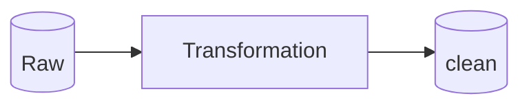
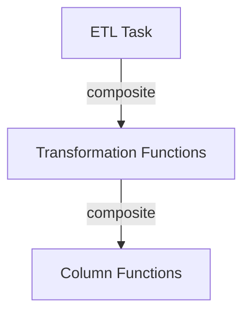

Building robust, scalable, and maintainable data pipelines is a cornerstone of modern data engineering. While object-oriented programming (OOP) has long been a dominant paradigm in software development, functional programming (FP) is uniquely well-suited for crafting data pipelines. FP’s immutability, statelessness, and composability address many challenges inherent in distributed and parallel data processing, making it a compelling choice over OOP for such tasks. Here are some reasons why functional programming is an excellent fit for crafting data pipelines.

## 1\. **Immutability Enhances Reliability**



One of the core principles of functional programming is immutability, where data cannot be modified once created. This feature naturally complements data pipeline operations, where data flows through a series of transformations without altering the original input. Immutability eliminates side effects and ensures that intermediate steps in the pipeline do not inadvertently change the data, resulting in more predictable and reliable pipelines.

For instance, consider a pipeline processing customer transaction records. With immutability, the original dataset remains intact, even after multiple transformations such as filtering, aggregation, or joining. Immutable data structures are especially critical in Big Data processing, where data often exceeds the storage capacity of a single server and must be processed on distributed clusters. Since immutable structures cannot be changed during execution, they eliminate errors caused by data being overwritten during parallel processing.

```python
# PySpark
def raw_to_clean_transformation(sdf: DataFrame) -> DataFrame:
    """
    We could write a test for this transformation 
    to ensure it performs the correct transformation.
    """
    return sdf.select(...)

bronze_sdf = spark.read.table("your_bronze_table")
silver_sdf = bronze_sdf.transform(raw_to_clean_transformation)
```

## **2\. Declarative Style for Readability and Maintainability**

Functional programming emphasizes a declarative style, where you describe what to do rather than how to do it. This approach enhances readability, making it easier for engineers to understand and modify code. Furthermore, the declarative style acts as a blueprint for the pipeline, clearly defining each stage of the process and enabling seamless collaboration across teams. This alignment works particularly well with the design of data pipelines, which often involve high-level operations like `map`, `filter`, and `reduce`.

## 3\. **Composable Functions Enable Modularity**



Functional programming thrives on the concept of composable functions. In the context of data pipelines, each stage of the pipeline can be designed as a pure function. These pure functions can be composed to form complex transformations.

This modular design makes it easier to test, debug, and reuse components across different pipelines. For example, in PySpark, we can modularize transformations into reusable functions. Consider the following code snippet:

```python
# PySpark
# Column Function
from pyspark.sql import functions as F
def plus_one(col_name: Column) -> Column:
    return col_name + 1
# Transformation Function
def number_plus_one_transform(sdf: DataFrame) -> DataFrame:
    return sdf.select(
        F.avg("number").alias("avg_number"),
        plus_one("number").alias("number_plus_1")
    )

target_sdf = source_sdf.transform(number_plus_one_transform)
```

Here, `number_plus_one_transform` is a standalone, testable function. By composing transformations like this, pipelines can be constructed incrementally and with clear separations of concern, following the principles of modularity and reusability.

Pure functions and immutability make functional code inherently easier to test. Each function can be tested in isolation without worrying about external state or side effects. Adding side effects like logging or I/O operations inside the function makes the code less testable and less readable. In data pipelines, this translates to more reliable unit tests and simpler debugging when issues arise.

<div data-node-type="callout">
<div data-node-type="callout-emoji">💯</div>
<div data-node-type="callout-text"><strong>Pure Function</strong>: a function that has no side effects and always produces the same output for the same input.</div>
</div>

## 4\. **Parallelism and Scalability**

Functional programming’s stateless nature and focus on immutability lend themselves to parallelism. Many functional programming languages and frameworks, such as Apache Spark with its functional APIs, are optimized for parallel data processing.

Statelessness—a hallmark of functional programming—ensures that functions do not rely on **external states or mutable data**. This is critical in Big Data, where processing is distributed across multiple machines. By ensuring that the same input always produces the same output, statelessness allows computations to run independently and safely in parallel systems.

## 5\. Integration with Frameworks

[](https://www.researchgate.net/figure/Word-count-program-flow-executed-with-MapReduce-5_fig6_270448794)

Functional programming integrates seamlessly with modern Big Data frameworks like Apache Spark, Flink, and Kafka Streams. These frameworks leverage FP principles, such as immutability and higher-order functions, to facilitate distributed and parallel data processing. For instance:

* **Apache Spark**: Provides functional APIs like `map`, `filter`, and `reduce` that align naturally with FP concepts.
    
* **Kafka Streams**: Uses FP to define stream transformations and aggregations in a concise, readable manner.
    
* **Flink**: Employs FP constructs to handle state and streaming computations efficiently.
    

By adopting FP principles, these frameworks enable developers to write concise, parallelizable, and scalable code for complex data pipelines.

## 6\. Future Trends in Functional Programming and Data Engineering

The adoption of functional programming is growing in response to evolving data engineering challenges. As organizations shift towards real-time analytics and streaming architectures, FP’s strengths become even more relevant. Declarative paradigms and functional constructs allow engineers to model complex workflows as simple, composable operations, making pipelines more maintainable and scalable.

Serverless data pipelines also benefit from FP’s stateless and parallel nature. With cloud platforms increasingly supporting serverless architectures, FP aligns with these trends, enabling engineers to focus on logic rather than infrastructure management.

## Conclusion

Functional programming brings a wealth of benefits that align seamlessly with the requirements of data pipelines. Its focus on immutability, composability, and declarative syntax makes it easier to build robust, scalable, and maintainable pipelines. Moreover, its inherent support for parallelism, error handling, and higher-order functions further solidifies its position as a paradigm of choice for data engineering tasks.

Adopting functional programming principles can empower data engineers to craft efficient and elegant pipelines. As the volume and complexity of data continue to grow, embracing functional programming ensures pipelines remain both scalable and resilient. If you haven’t yet explored functional programming for your data pipeline needs, now might be the perfect time to start.

# Next Step

To further understand functional programming for Big Data. You could visit [**Functional programming for Big Data - Ada Computer Science**](https://adacomputerscience.org/concepts/bigdata_func?topic=big_data)**. Also, you could check out my other blog post:** [Crafting PySpark Custom Functions](https://cenz.hashnode.dev/crafting-pyspark-custom-functions#heading-build-your-own-custom-function-for-column-transformation)

---

If you have any questions or feedback, feel free to leave a comment below or send me a message on LinkedIn! 📩. Happy coding! 😊

[](https://www.linkedin.com/in/cenzwong/)

---

# Epilogue

As 2024 comes to an end, I’ve been reflecting on the lessons I’ve learned, especially in the realm of data engineering. One of the biggest takeaways for me this year has been the value of **functional programming** in building **data pipelines**.

Data pipelines are not static software products where the code remains unchanged over time. They’re dynamic systems—schemas evolve, data volumes increase, and new requirements emerge. Instead of investing excessive time in creating overly complex software abstractions, which can slow down progress and complicate collaboration, the focus should be on building pipelines that are:

* **Adaptable to changes**
    
* **Easy to maintain**
    
* **Well-aligned with the data’s nature**
    

Unlike software products, where a deep understanding of every piece of code may not always be necessary, a data pipeline requires you to truly **understand the data**—how it’s stored, how it flows, and how it transforms. This highlights the importance of strengthening core data engineering knowledge:

* **Dimensional modeling** to design effective data warehouses
    
* **Data quality assurance** to ensure reliability
    
* **Scalable designs** that can handle growth
    

Over-investing in abstractions that wrap around existing frameworks can lead to unintended consequences:

* Rebuilding the same wheel
    
* Making the codebase harder for peers to understand and maintain
    

Instead, let’s prioritize simplicity, maintainability, and clarity. After all, the goal of a data pipeline isn’t just to move data—it’s to empower businesses with **trustworthy, actionable insights**.

Looking forward to another year of growth in 2025! 💡