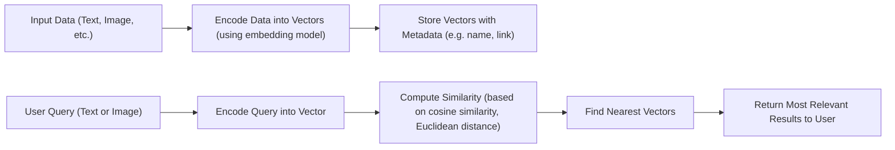

In a world flooded with text, images, videos, and user interactions, we’re moving beyond just searching with keywords. Today, many systems — from AI chatbots to recommendation engines — rely on something deeper: **searching by meaning**.

Enter the **vector database**.

While it sounds like an advanced AI concept, it’s rooted in something surprisingly old-school: [**Word2Vec**](https://arxiv.org/pdf/1301.3781) — a model introduced in 2013. In this post, we’ll explore how vector databases work, why they matter, and how they’re useful even beyond AI.

## 🧠 From Word2Vec to Vector Thinking

Back in 2013, Google introduced **Word2Vec**, a model that transformed how we process and compare words. Instead of relying on text matching, it represented each word as a **vector** — a list of numbers — based on the context in which it appears.

This had a profound result: words with similar meanings ended up close together in space.

Example:

```python
import gensim.downloader

wv = gensim.downloader.load('word2vec-google-news-300')
```

* `"king" – "man" + "woman" ≈ "queen"`
    
* ```python
          wv.most_similar(positive=['king', 'woman'], negative=['man'], topn=1)
          # [('queen', 0.7118193507194519)]
    ```
    
* `"cat"` and `"dog"` were closer in the vector space than `"cat"` and `"car"`
    
* ```python
          wv.similarity("cat", "dog")
          # 0.76094574
          wv.similarity("cat", "car")
          # 0.21528184
    ```
    

These vectors captured **semantic relationships**, which opened the door for **search by similarity** — not just by keywords.

> Reference:
> 
> * [GenSim Docs](https://radimrehurek.com/gensim/auto_examples/tutorials/run_word2vec.html#sphx-glr-auto-examples-tutorials-run-word2vec-py)
>     
> * [Colab](https://colab.research.google.com/drive/1dia98UXzw-cJinZCdMd3VecvlLxhxU5d?usp=sharing)
>     

## 🧮 What Is a Vector Database?

A **vector database** is a system built to store and search high-dimensional vectors efficiently.

These vectors might come from:

* Text embeddings (e.g., Word2Vec, BERT, OpenAI)
    
* Image features
    
* Audio fingerprints
    
* Structured numeric features (e.g., coordinates or behavioral scores)
    

> In short, a vector database helps you find **"what's most similar"** rather than just **"what matches"**.

It uses algorithms like **Approximate Nearest Neighbor (ANN)** to quickly find the most similar vectors in large datasets — even millions of items.

## 🔧 How Vector Search Works (Simplified)



1. **Convert data into vectors**  
    Use a model (like Word2Vec or an image encoder) to generate a vector
    
2. **Store the vectors**  
    Each vector is stored with its associated metadata (e.g. product name, link, image)
    
3. **Embed the query**  
    A user’s input is also converted into a vector using the same model
    
4. **Search by similarity**  
    The database finds the “nearest” vectors — based on cosine similarity, Euclidean distance, etc.
    
5. **Return results**  
    You retrieve the most relevant results based on the similarity scores
    

## 📍 What About Coordinates and Numeric Vectors?

Not all vectors come from AI models. In fact, **vector search works just as well with structured numerical features** — like coordinates, sensor readings, or user profile data.

Examples:

* `[latitude, longitude]` — for nearby location search
    
* `[age, income, spending_score]` — for customer segmentation
    
* `[temp, humidity, pressure]` — for anomaly detection in IoT
    

These vectors aren’t “semantic,” but they’re still searchable by similarity. This makes vector databases useful in fields like logistics, retail analytics, health tech, and mobility.

| Use Case | Vector Example | What It Does |
| --- | --- | --- |
| Store locator | `[lat, lon]` | Finds closest store to a customer |
| Customer clustering | `[age, income, loyalty]` | Groups similar shoppers |
| Sensor anomaly detection | `[temp, humidity, voltage]` | Flags abnormal behavior in IoT data |
| Driving pattern analysis | `[lat, lon, speed]` | Compares vehicle routes and habits |

## 🧰 Complementing Traditional Databases

It’s important to note: **vector databases aren’t here to replace your current databases**.

Instead, they **work alongside** relational (SQL), NoSQL, and search systems like Elasticsearch.

Example:

* Store product info (ID, name, price) in **PostgreSQL**
    
* Store image or description embeddings in a **vector DB**
    
* Use both together for a smarter, hybrid search system
    

You get the best of both worlds: structured filtering + fuzzy semantic matching.

## 💡 Real-World Applications

Vector databases are already powering many tools and features you use today:

| Application Area | Example Use Case |
| --- | --- |
| Semantic search | Search documents by meaning, not keywords |
| Product recommendations | Suggest similar items based on user clicks |
| Chatbot memory | Retrieve relevant past conversations |
| Image similarity search | Find clothes or objects that *look* alike |
| Music/audio matching | Group songs with similar tone or mood |
| Location-based filtering | Find nearest neighbors with `[lat, lon]` |

## 🧱 Tools You Can Use

There are a variety of tools designed for vector storage and similarity search:

| Tool | Highlights |
| --- | --- |
| [**LanceDB**](https://www.lancedb.com) | Developer-friendly, fast, open-source |
| [**Weaviate**](https://weaviate.io) | Hybrid search support, built-in ML features |
| [**Pinecone**](https://www.pinecone.io) | Fully managed, scalable, production-grade |
| [**Milvus**](https://milvus.io) | High-performance, supports billions of vectors |
| [**FAISS**](https://ai.meta.com/tools/faiss/) | Meta’s open-source library for vector search |
| [ChromaDB](https://www.trychroma.com) | Open-source search and retrieval database for AI applications |
| [Qdrant](https://qdrant.tech) | Open-source, optimized for neural search |

Some databases like **Elasticsearch** and **Postgres** are also adding vector search features. Also, three main cloud providers:

* [**Azure Vector Database Offering**](https://learn.microsoft.com/en-us/azure/architecture/guide/technology-choices/vector-search)
    
* [**AWS Vector Database Offeri**](https://learn.microsoft.com/en-us/azure/architecture/guide/technology-choices/vector-search)[**ng**](https://aws.amazon.com/what-is/vector-databases/)
    
* [**GCP Vector Database Of**](https://aws.amazon.com/what-is/vector-databases/)[**fering**](https://cloud.google.com/discover/what-is-a-vector-database?hl=en)
    

> AWS just launched a new [S3 Vector Bucket](https://aws.amazon.com/s3/features/vectors/)

## 🚀 Final Thoughts

From the early days of **Word2Vec**, we’ve known that similarity matters more than exact matches. Today, with powerful models generating vector embeddings for all types of data — text, images, audio, coordinates — **vector databases** provide the infrastructure to search them efficiently.

Whether you're building:

* A semantic search engine
    
* A recommendation system
    
* A chatbot with memory
    
* Or simply grouping users or locations by similarity
    

...vector databases are becoming a core part of the modern AI-powered stack.

> The future of search is not just about finding exact matches — it’s about understanding **what’s truly similar**.

---

If you have any questions or feedback, feel free to leave a comment below or send me a message on LinkedIn! 📩. Happy coding! 😊

[](https://www.linkedin.com/in/cenzwong/)